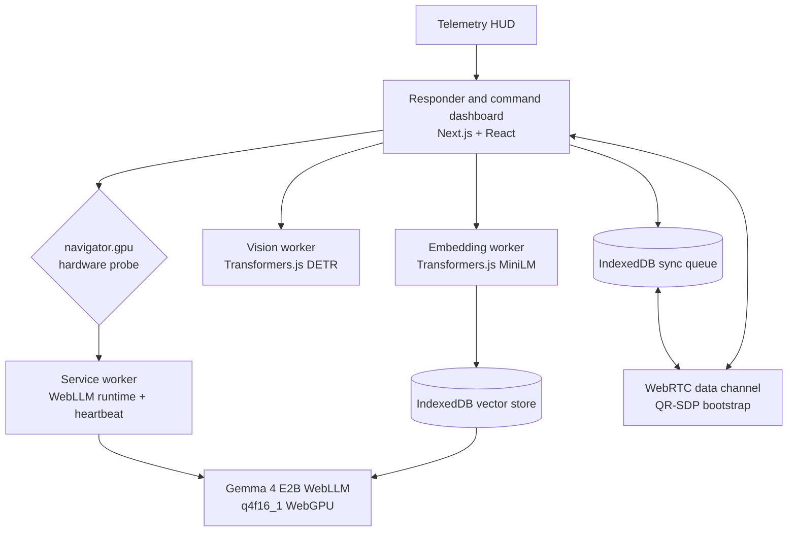

<h1 align="center">ResilNode</h1>

<h3 align="center">
  A zero-server, browser-native AI command system for disconnected disaster response
</h3>

<p align="center">
  
  
  
  
</p>

<p align="center">
  
  
  
  
</p>

<p align="center">
  <b>Emanuel Lázaro</b><br />
  <i>Full-stack and ML engineer, independent researcher</i>
</p>

<p align="center">
  <a href="#abstract">Abstract</a> |
  <a href="#system-overview">System Overview</a> |
  <a href="#architecture">Architecture</a> |
  <a href="#model-strategy">Model Strategy</a> |
  <a href="#open-source-use">Open Source Use</a>
</p>

## Abstract

Disaster response systems often assume that wide-area networks, cloud inference APIs, and centralized coordination services remain available. In the failure modes that matter most, those assumptions collapse together. ResilNode explores a different operating model: local-first artificial intelligence running inside the browser, paired with peer-to-peer synchronization and durable offline state.

ResilNode is a Progressive Web Application (PWA) that combines WebLLM, WebGPU, Transformers.js workers, WebRTC data channels, and IndexedDB into a self-contained field command surface. It probes device capabilities, loads a verified Gemma 4 WebLLM artifact when WebGPU is available, performs visual and embedding work off the main thread, queues escalation payloads locally, and exchanges synchronization data through QR-assisted WebRTC handshakes.

The project is both a working application and a reference architecture for browser-native resilience engineering. It is designed to be inspected, forked, measured, and extended without requiring an application server or hosted model gateway.

## Problem Statement

Field operators in a degraded communications environment need three things at the same time:

- Local reasoning that does not depend on API reachability.
- A way to preserve and forward operational payloads while links are intermittent.
- Interfaces that remain usable on commodity responder hardware.

Traditional architectures place coordination logic behind server APIs and treat the browser as a thin client. ResilNode treats the browser as the deployment target. The system keeps inference, sensor preprocessing, vector retrieval, mesh signaling, and persistence within web platform primitives that can be cached and operated offline.

## Design Goals

- **Zero server dependency:** no bespoke backend is required for the core application loop.
- **Hardware-aware execution:** the app probes `navigator.gpu` before selecting model behavior.
- **Offline durability:** mission payloads and reference vectors persist in IndexedDB.
- **Thread isolation:** model, vision, and embedding work avoid blocking the React UI.
- **Peer synchronization:** WebRTC data channels are bootstrapped by QR-encoded SDP exchange.
- **Auditable implementation:** core math, queueing, and routing logic are covered by unit tests.

## System Overview

ResilNode is organized around a single command dashboard:

- A hardware probe classifies the browser into edge or command-capable tiers.
- A WebLLM service worker hosts the local Gemma runtime and receives heartbeat traffic.
- A vision worker runs DETR object detection through Transformers.js.
- An embedding worker generates MiniLM vectors for local retrieval.
- A vector store ranks reference chunks by cosine similarity.
- A triage orchestrator decides whether to answer locally, retrieve context, send through mesh, or queue for later synchronization.
- A telemetry overlay displays runtime state such as mesh status, queue depth, estimated VRAM use, TTFT, and tokens per second.

## Architecture



### Browser Runtime

The application runs as a Next.js App Router PWA. Strict cross-origin isolation headers are configured so that browser ML runtimes can use the low-level primitives they need. The WebLLM engine is created through `CreateServiceWorkerMLCEngine`, with a 5000 ms keep-alive interval and explicit unload/reset controls exposed in the UI.

### Worker Isolation

Vision and embedding pipelines run in dedicated module workers:

- `workers/vision.worker.ts` loads `Xenova/detr-resnet-50` for object detection.
- `workers/embedding.worker.ts` loads `Xenova/all-MiniLM-L6-v2` for local text embeddings.

Both workers use request identifiers and timeout cleanup so parallel requests cannot resolve the wrong promise or leave stale listeners behind.

### Offline Persistence

Two IndexedDB-backed stores provide durable local state:

- `SyncQueue` stores escalation and sensor payloads until an open WebRTC data channel is available.
- `VectorStore` stores text chunks and embeddings for local retrieval-augmented generation.

The queue flushes in insertion order and preserves unsent payloads when transmission fails.

## Model Strategy

ResilNode separates model intent from model availability.

| Role           | Model identifier             | Runtime status                                                                                    |
| -------------- | ---------------------------- | ------------------------------------------------------------------------------------------------- |
| Edge reasoning | `gemma-4-E2B-it-q4f16_1-MLC` | Configured as the active WebLLM model                                                             |
| Command target | `gemma-4-E4B-it`             | Recorded as the high-tier target; routed to E2B until a verified MLC/WebLLM artifact is available |

The active WebLLM record points to:

```text
https://huggingface.co/welcoma/gemma-4-E2B-it-q4f16_1-MLC
```

The app does not invent model IDs for unavailable artifacts. If hardware is classified as command-capable, the UI surfaces the E4B fallback reason and loads the verified E2B WebLLM package instead.

## Data Flow

1. The browser probes WebGPU support and storage-buffer limits.
2. The operator loads the local WebLLM runtime.
3. The operator captures an image or uploads a still image for visual context.
4. The vision worker returns object detections.
5. The triage orchestrator evaluates the text prompt and visual context.
6. Straightforward prompts are answered locally.
7. Structural calculation prompts are sent over mesh when connected or written to `SyncQueue` when disconnected.
8. Command-capable queries can retrieve local reference context from `VectorStore` before generation.

## Open Source Use

### Requirements

- Node.js 20 or newer.
- pnpm 10 or newer.
- A browser with WebGPU support for local WebLLM text generation.
- HTTPS or localhost for camera, service worker, and WebRTC APIs.

### Installation

```bash
pnpm install
```

### Development

```bash
pnpm dev
```

Open the local Next.js URL shown by the dev server. For a full browser path, use Chrome or Edge with WebGPU enabled.

### Validation

```bash
pnpm run lint
pnpm run typecheck
pnpm test
pnpm run build
```

The unit tests cover:

- Sync queue enqueue, dequeue, flush, and failure-retention behavior.
- Cosine similarity math for vector search.
- Hardware tier classification and model fallback routing.

## Repository Map

```text
app/                         Next.js App Router UI
components/                  Camera, QR handshake, telemetry, service worker registration
lib/hardware-probe.ts        WebGPU probing and tier classification
lib/llm-client.ts            WebLLM service-worker initialization
lib/model-catalog.ts         Verified Gemma model records
lib/sync-queue.ts            IndexedDB synchronization queue
lib/vector-db.ts             IndexedDB vector store and cosine similarity
lib/triage-orchestrator.ts   Vision, RAG, LLM, and mesh coordination
lib/webrtc-mesh.ts           QR-SDP WebRTC data-channel transport
workers/                     Transformers.js vision and embedding workers
sw.ts                        Service worker source
public/service-worker.js     Bundled service worker served by the PWA
tests/                       Vitest unit tests
```

## Security and Privacy Model

ResilNode keeps the core operational path local to the browser. Prompts, detections, embeddings, queued payloads, and reference chunks are stored on-device unless the operator explicitly establishes a mesh channel and transmits a payload. The app does not require API keys for the local workflows.

The design still inherits normal browser constraints:

- WebGPU availability is browser and hardware dependent.
- Service workers can be terminated by user agents despite heartbeat activity.
- Camera access requires explicit user permission.
- WebRTC QR-SDP exchange does not replace authentication or operational trust procedures.

## Extension Points

The codebase is structured so contributors can extend one subsystem without rewriting the whole application:

- Add a verified E4B WebLLM `ModelRecord` in `lib/model-catalog.ts`.
- Add new payload types to `SyncQueue` for additional field telemetry.
- Replace or supplement the bundled reference datasets in `lib/document-parser.ts`.
- Add richer command-node behavior to inbound mesh message handling.
- Add authenticated payload signing before mesh transmission.

## License

ResilNode is licensed under the Apache License 2.0. See [LICENSE](./LICENSE).

---

<p align="center">
  <i>Built for the <a href="https://www.kaggle.com/competitions/gemma-4-good-hackathon">Gemma 4 Good Hackathon</a>. Redefining the limits of edge intelligence.</i>
</p>
