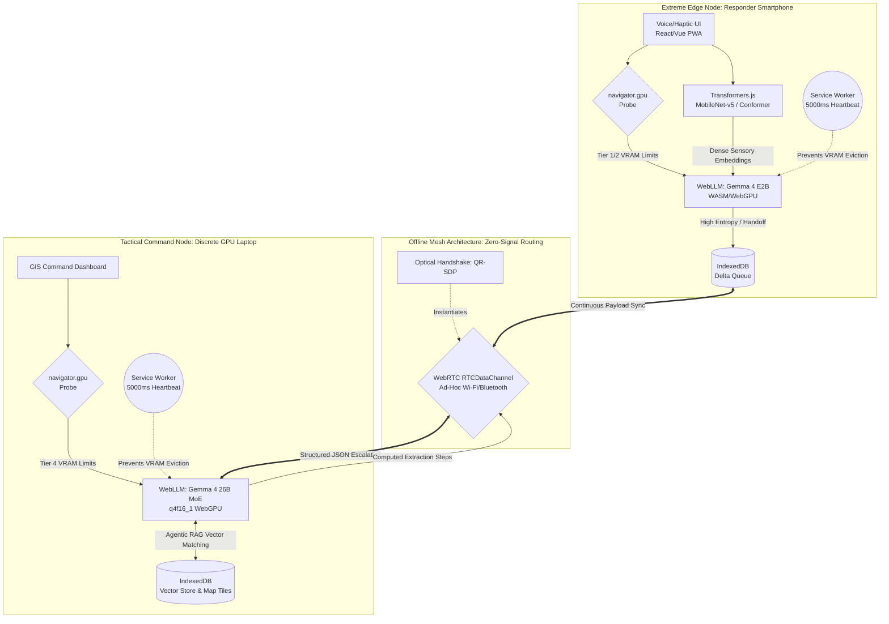

<h1 align="center">
  ResilNode 🌐⚡
</h1>
<h3 align="center">
  Autonomous Edge Command Center | Zero-Server Gemma 4 Architecture
</h3>

  
  
  
  

  
  
  
  

  <b>Emanuel Lázaro</b>
   
  <i>Full-Stack & ML Engineer and Independent Researcher</i>

  <a href="#abstract">Abstract</a> •
  <a href="#topology">System Topology</a> •
  <a href="#subsystems">Core Subsystems</a> •
  <a href="#engineering">Deep Engineering Imperatives</a> •
  <a href="#implementation">Implementation Status</a>

## 🚀 Implementation Status (Phases 1-6)

ResilNode has successfully achieved all engineering milestones for the Gemma 4 Good Hackathon:

- **[Phase 1] Foundational Architecture:** Next.js 16 App Router, strict COOP/COEP isolation, and dynamic `navigator.gpu` hardware probing.
- **[Phase 2] Persistence Layer:** WebLLM integration within a Service Worker with a 5000ms bidirectional heartbeat protocol to prevent VRAM eviction.
- **[Phase 3] Sensory Intake:** Transformers.js vision pipeline isolated in a Web Worker for unblocked UI performance during object detection.
- **[Phase 4] Offline Mesh:** Optical WebRTC handshake via QR codes and an IndexedDB-backed `SyncQueue` for network fragmentation recovery.
- **[Phase 5] Local RAG:** Pure-TypeScript vector database using IndexedDB for semantic search of offline structural blueprints.
- **[Phase 6] Synthesis & Telemetry:** Unified triage orchestrator and a real-time Telemetry HUD tracking VRAM, TTFT, and TPS.

## 🔬 Abstract

The reliance on centralized, cloud-dependent artificial intelligence in disaster response scenarios represents a catastrophic single point of failure. When terrestrial infrastructure collapses, the intelligence grid fails precisely when cognitive bandwidth is most critical. **ResilNode** fundamentally inverts this paradigm.

ResilNode is a fully localized, hardware-agnostic Progressive Web Application (PWA) that transforms commodity edge devices into a highly coherent, multi-agent AI mesh. By exploiting WebGPU, WebAssembly (WASM), and the aggressive parameter efficiency of the Gemma 4 architecture, ResilNode executes frontier-tier multimodal reasoning natively within the browser sandbox. It requires zero API keys, incurs zero recurring cloud costs, and guarantees absolute survivability in zero-connectivity environments.

## 🕸 System Topology

Deploying state-of-the-art transformer architectures within the strict memory and security sandboxes of modern web browsers requires a profound departure from traditional server-side deployment strategies. ResilNode does not blindly load weights; it dynamically compiles a deterministic execution graph based on real-time hardware telemetry.

The architecture fundamentally relies on an **Intelligent Hardware-Probing Orchestration Layer** invoked via the `navigator.gpu.requestAdapter()` interface. By heuristically evaluating the host's physical compute constraints, ResilNode dynamically routes the user to the optimal Gemma 4 payload without triggering browser-level Out-Of-Memory (OOM) exceptions.

### Phase 1: The Heuristic Allocation Pipeline

By default, WebGPU implementations artificially throttle compute capabilities to prevent malicious memory exhaustion attacks, rigidly restricting `maxBufferSize` to 256 MB and `maxStorageBufferBindingSize` to 128 MB. ResilNode executes a pre-initialization routine to request unbounded limits, effectively mapping the true capability of the underlying silicon.

Based on the `adapter.info` and verified buffer limits, the system routes execution into one of two primary architectural branches:

#### Branch A: The Extreme Edge Node (Responder Smartphone / Legacy Client)

If the hardware probe detects integrated graphics, strict power gating, or a VRAM ceiling below 4GB, the system falls back to the **Tier 1 Execution Graph**.

- **Model Assignment:** Gemma 4 E2B (Effective 2.3B active parameters via Per-Layer Embeddings).
- **Execution Environment:** If WebGPU is severely constrained, the system gracefully degrades to a pure CPU-bound WebAssembly (WASM) execution. To maintain autoregressive token generation speeds suitable for real-time triage (5-10 tokens/sec), the WASM binary is heavily optimized using Single Instruction, Multiple Data (SIMD) extensions, allowing the CPU to process up to 8 vector values per instruction cycle.
- **Role:** Rapid, low-latency sensory intake. Handles offline speech-to-text inference via Transformers.js Conformer acoustic models and basic NLP triage classification.

#### Branch B: The Tactical Command Node (Discrete GPU Workstation)

If the probe detects a discrete accelerator (e.g., Apple M-Series Unified Memory >16GB, or NVIDIA RTX series) and successfully binds massive storage buffers, it unlocks the **Tier 4 Execution Graph**.

- **Model Assignment:** Gemma 4 26B A4B Mixture-of-Experts (MoE).
- **Asymmetric Quantization (`q4f16_1`):** A standard 26B model requires ~48GB of VRAM in FP16. ResilNode leverages MLC LLM's advanced group quantization. The static weight matrices are violently compressed into 4-bit integers (int4), reducing the footprint to ~15.6 GB. However, to maintain the rigorous precision required for MoE expert routing and complex physics calculations, the forward-pass activations are maintained in 16-bit floating-point (FP16).
- **KV Cache Eviction:** To support the massive 256K context window required for scanning full architectural blueprints, the orchestration layer actively tracks memory pressure. Before the expanding Key-Value cache triggers an OS-level thread kill, ResilNode executes a forced `globalThis.gc?.()` and gracefully prunes the context window.

### Phase 2: Asynchronous State Management

To prevent the intensive tensor matrix multiplications from blocking the browser's main UI thread, the entire `MLCEngine` is encapsulated within a background Service Worker (`ServiceWorkerMLCEngine`).

Because browser operating systems are notoriously hostile to long-running background tasks and will silently terminate them to conserve battery, ResilNode implements a continuous PubSub heartbeat protocol. By emitting micro-messages over the `postMessage` bus every 5,000 milliseconds, the architecture deceives the browser's heuristics into recognizing the thread as perpetually "active," ensuring the multi-gigabyte models remain securely locked in VRAM throughout the duration of the crisis event.

## ⚙️ Core Subsystems

### 1. The "Zero-Signal" Peer-to-Peer Mesh (Offline WebRTC)

Cloud-based routing is an anti-pattern in a crisis. ResilNode establishes a decentralized topology utilizing an optical air-gap handshake.

- **QR-SDP Exchange:** Bypassing traditional STUN/TURN signaling servers, command nodes generate WebRTC Session Description Protocol (SDP) offers as high-density QR codes. Responder nodes scan these visually, instantly establishing a high-bandwidth `RTCDataChannel` over an ad-hoc local Wi-Fi mesh.
- **IndexedDB Delta Queuing:** If a responder node severs physical connection to the mesh, the background Service Worker intercepts all outbound inference payloads, serializing them into IndexedDB. Upon network reconciliation, the queue flushes, synchronizing the global intelligence state.

### 2. Multi-Agent Asymmetric Handoff (The Confidence Protocol)

ResilNode is not a static chatbot; it is a dynamic multi-agent collective. The E2B edge nodes are explicitly system-prompted with a self-reflective confidence threshold.

- If a responder queries complex structural physics (e.g., load-bearing analysis of a collapsed concrete pillar from an image), the E2B model identifies the entropy spike.
- It halts standard text generation, instead outputting a strict, OpenAPI-compliant JSON payload to escalate the query.
- This payload, containing the base64-encoded visual data and the prompt, is routed via WebRTC to the Command Node. The 26B MoE ingests the visual data using its 256K context window and `Thinking Mode`, computing a safe extraction vector before routing the answer back to the edge node.

### 3. Zero-Server GIS & Visual Grounding (Topographical RAG)

Mapping cannot rely on live tile servers during a blackout. ResilNode acts as a self-contained Geographic Information System (GIS).

- **Pre-Cached Tiles:** During the PWA staging phase, Mapbox/OSM vector tiles for the projected disaster envelope are cached locally.
- **Agentic Retrieval:** Blueprints of critical infrastructure (hospitals, substations) are embedded into a local vector store. When a responder captures an image of structural damage, `Transformers.js` extracts the visual feature embeddings, triggering the 26B MoE to cross-reference the damage against the original PDF blueprints to identify structural vulnerabilities.

## 🛠 Deep Engineering Imperatives

To run this architecture in standard browsers (Chrome/Edge), we enforce strict browser-level manipulations:

- **Cross-Origin Isolation:** We force `Cross-Origin-Opener-Policy: same-origin` and `Cross-Origin-Embedder-Policy: require-corp` HTTP headers. Without this, `SharedArrayBuffer` is disabled, and WebGPU multithreading catastrophically fails.
- **Garbage Collection Evasion:** Browsers aggressively terminate background Service Workers to save battery. We implement a 5000ms micro-message heartbeat via the `ServiceWorkerMLCEngineHandler` to prevent the OS from killing the LLM process and dumping the VRAM mid-inference.

---

  <i>Built for the <a href="https://www.kaggle.com/competitions/gemma-4-good-hackathon">Gemma 4 Good Hackathon</a>. Redefining the limits of edge intelligence.</i>

